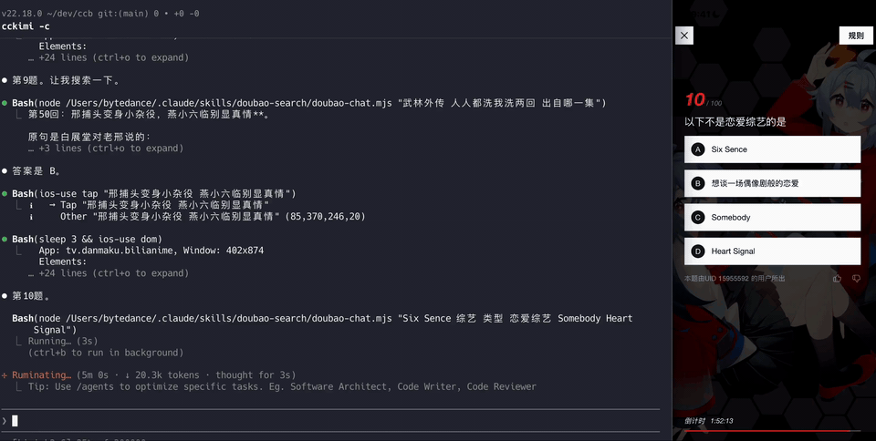

# ios-use

> Fast iOS UI automation from the terminal, powered by a lightweight XCTest TCP driver.

[](https://github.com/xhzq233/ios-use/releases)
[](LICENSE)
[](#dependency-matrix)

`ios-use` drives real iPhones and Simulators directly from a Swift CLI. It avoids the usual Appium Server -> WebDriverAgent HTTP stack, so agents and scripts can inspect UI state, find labels, tap, swipe, capture logs, and run YAML flows with much lower overhead.



## Quick Start

```bash
curl -fsSL https://raw.githubusercontent.com/xhzq233/ios-use/main/scripts/install.sh | bash -s --

ios-use devices
ios-use config --udid <device-udid>
ios-use start <device-udid>
ios-use activateApp com.apple.Preferences
ios-use dom
```

After `start`, screen-driving commands target the selected device. To switch devices, run `ios-use stop`, then `ios-use start <other-udid>`.

## Why ios-use

- **Built for tight agent loops**: `dom` and `find` are cheap enough to call before actions instead of guessing UI state.
- **No automation server to run**: no Appium server, no WDA checkout, no iproxy process, no separate WebDriver bridge.
- **Label-first actions**: tap, input, waitFor, and swipe can target visible UI text before falling back to coordinates.
- **Real device and Simulator support**: real devices connect through usbmuxd; Simulators connect over `localhost`.
- **Flows, logs, and proxy capture included**: YAML flows, OSLog, NSLogger, and HTTP/HTTPS proxy capture are first-class CLI workflows.

## What It Is

`ios-use` is a command-line automation tool for macOS users who want direct iOS UI control.

It is **not** a WebDriver-compatible Appium server. If you need Selenium/Appium protocol compatibility, use Appium. If you want a small CLI that an AI agent or local script can call repeatedly, `ios-use` is optimized for that path.

Driving devices still requires Apple's tooling:

- Real devices require USB and a full Xcode install.
- Simulators require a full Xcode install and the target Simulator runtime.
- Real-device first setup requires Apple ID signing. A free Apple Developer account is enough.

## Installation

### Install The CLI

```bash
curl -fsSL https://raw.githubusercontent.com/xhzq233/ios-use/main/scripts/install.sh | bash -s --
```

The installer downloads the prebuilt Apple Silicon macOS CLI and driver IPAs from the latest GitHub Release, then installs `ios-use` into a user-writable bin directory. To install a specific version:

```bash
curl -fsSL https://raw.githubusercontent.com/xhzq233/ios-use/main/scripts/install.sh | bash -s -- --version v1.1.0
```

Intel Macs should compile locally instead:

```bash
curl -fsSL https://raw.githubusercontent.com/xhzq233/ios-use/main/scripts/install.sh | bash -s -- --build-from-source
```

### First-Time Setup

Choose the environment you want to drive.

**Real device:**

```bash
ios-use devices

# First run: provide Apple ID credentials if prompted.
ios-use config --udid <device-udid> --apple-id <email> --password '<app-password>'

# Later runs: cached signing state is reused.
ios-use config --udid <device-udid>
ios-use start <device-udid>
```

**Simulator:**

```bash
ios-use devices --simulator
ios-use config --simulator --udid <simulator-udid>
ios-use start <simulator-udid>
```

When upgrading `ios-use`, run `ios-use devices` after installation. If a device line says `driver update required`, run `ios-use config --udid <device-udid>` again so the on-device driver matches the newly installed CLI.

## Command Overview

| Command | Use it for |
| --- | --- |
| `devices` | List real devices or Simulators and see configuration status. |
| `config` | Install or update the on-device driver. |
| `start` / `stop` | Select or release the current automation target. |
| `activateApp` / `terminateApp` | Open or close an app by bundle ID. |
| `dom` | Print the current UI tree for inspection and planning. |
| `find` | Locate elements by label/value text and optional traits. |
| `tap` / `longpress` | Act on a label or coordinate. |
| `swipe` | Scroll by direction/distance or toward a target label. |
| `input` | Focus a text field by label and type content. |
| `screenshot` | Capture a visual fallback when DOM is not enough. |
| `flow` | Run a YAML automation flow. |
| `oslog` / `nslog` | Capture system logs or app-side NSLogger output. |
| `proxy` | Capture HTTP/HTTPS traffic through mitmproxy. |
| `open` | Open a URL or custom scheme on a device. |

Typical manual loop:

```bash
ios-use activateApp com.apple.Preferences
ios-use dom
ios-use find "蓝牙"
ios-use tap "通用"
ios-use swipe --to "开发者" --from "蓝牙"
ios-use input --label "搜索" --content "蓝牙"
ios-use screenshot --name settings-home
```

Typical flow:

```bash
ios-use flow flows/test_flow.yaml
```

## Performance Snapshot

The benchmark below compares `ios-use` against the full `Appium Server -> WebDriverAgent` stack on the same real-device Settings scenario.

| Case | ios-use Avg | Appium+WDA Avg | Reduction |
| --- | ---: | ---: | ---: |
| `dom` | `13.5 ms` | `984.2 ms` | `98.6%` |
| `find` | `15.7 ms` | `279.8 ms` | `94.4%` |
| `waitFor` | `13.7 ms` | `277.2 ms` | `95.1%` |
| `screenshot` | `45.5 ms` | `215.0 ms` | `78.8%` |
| `tap_label` | `542.8 ms` | `1089.5 ms` | `50.2%` |

These are the operations that matter most to AI agents: refresh UI state, locate targets, wait for changes, and act. Full benchmark setup and results are in [docs/benchmark.md](docs/benchmark.md).

## Flow Example

```yaml
name: Settings Search
app: com.apple.Preferences
steps:
  - action: waitFor
    label: 蓝牙
    timeout: 8

  - action: tap
    label: 蓝牙

  - action: dom
    outputs: settingsDom
```

Run it with:

```bash
ios-use flow settings.yaml
```

## Dependency Matrix

| Dependency | Install CLI | Real Device | Simulator / Dev |
| --- | --- | --- | --- |
| `bash`, `curl`, `tar` | required | not needed after install | dev also uses them |
| `swift` | only for `--build-from-source` | not needed after install | required for SwiftPM development |
| `xcrun xctrace` | not needed | required for device discovery | not needed |
| `xcrun devicectl` | not needed | required for install and launch | not needed |
| `xcrun simctl` | not needed | not needed | required for Simulator config; dev build also uses it |
| `unzip` | not needed | required during `config` | required during Simulator `config` |
| `altsign-cli` | copied by installer if bundled | required for real-device signing | not needed |
| `openssl` | not needed | required for real-device `oslog` TLS relay | not needed |
| `dns-sd` | not needed | optional for NSLogger Bonjour publish | optional for NSLogger Bonjour publish |
| `mitmproxy` | not needed | proxy capture only | proxy capture only |
| `xcodebuild`, `zip`, `mktemp` | not needed | not needed at runtime | required for `scripts/build_driver.sh` |
| `appium`, `lsof` | not needed | not needed at runtime | benchmark only |

## Repository Layout

```text
swift-cli/             Swift CLI, command parsing, config, Flow, host tools
shared/IOSUseProtocol/ Shared Swift RPC types and Fory frame models
driver/                Swift XCTest driver
flows/                 Example flows
scripts/               Install, build, test, and benchmark utilities
docs/                  Public documentation
assets/                Prebuilt driver artifacts
```

## Development

```bash
git clone https://github.com/xhzq233/ios-use.git
cd ios-use
bash scripts/build_swift_cli.sh --debug
./ios-use --help
bash scripts/build_driver.sh
bash scripts/ci_test.sh
```

`bash scripts/build_swift_cli.sh` builds the local workspace CLI to repo-root `./ios-use`; use that binary for development instead of a global `ios-use`. `scripts/ci_test.sh` is the default CI/local Swift-only validation path. Full Simulator command matrix tests use `bash scripts/ci_full_simulator.sh --driver-ipa <driver-sim.ipa>`. See `scripts/README.md` for the script index.

## Acknowledgments

- **[WebDriverAgent](https://github.com/appium/WebDriverAgent)**: This project borrows heavily from the ideas and implementation patterns established by WebDriverAgent. Gesture synthesis, snapshot handling, scrolling behavior, and parts of the driver architecture were shaped by studying WDA's source.
- **[appium-xcuitest-driver](https://github.com/appium/appium-xcuitest-driver)**: The CLI and session behavior were informed by how the Appium XCUITest ecosystem exposes XCTest automation to users.
- **[Appium](https://github.com/appium/appium)**: Appium helped establish the mental model for cross-device automation workflows, including action-oriented commands and reusable sessions.

## License

[GNU AGPL v3.0](https://www.gnu.org/licenses/agpl-3.0.html) - see [LICENSE](LICENSE).
