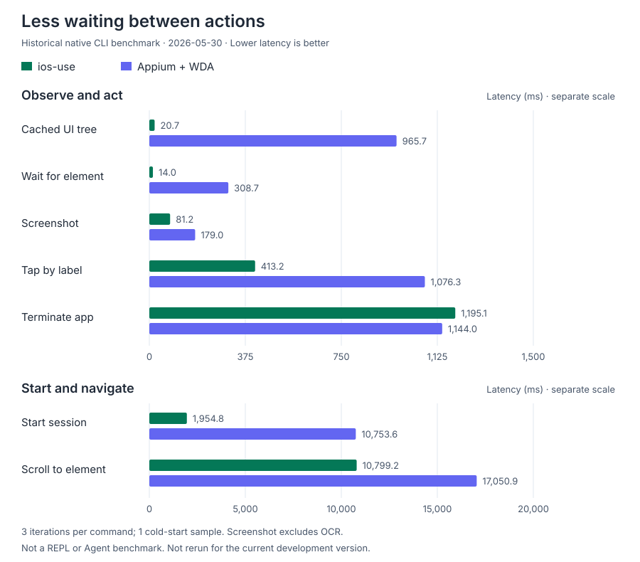

# ios-use

> Fast iOS UI automation for agents and scripts.

[](https://github.com/xhzq233/ios-use/releases)
[](LICENSE)
[](#requirements)

`ios-use` drives real iPhones, Simulators, and supported iPhone Apps on Apple
silicon Macs. It exposes a compact accessibility tree, semantic actions, JSON
output, screenshots, logs, proxy capture, and a persistent multi-device REPL.

## Install

```bash
curl -fsSL https://raw.githubusercontent.com/xhzq233/ios-use/main/scripts/install.sh | bash -s --
```

Install a specific release or build from source:

```bash
curl -fsSL https://raw.githubusercontent.com/xhzq233/ios-use/main/scripts/install.sh | bash -s -- --version v2.0.4
curl -fsSL https://raw.githubusercontent.com/xhzq233/ios-use/main/scripts/install.sh | bash -s -- --build-from-source
```

## Quick Start

### Real device

Connect an unlocked iPhone over USB, then run:

```bash
ios-use status

# First setup: authenticate AltSign once, then install the driver.
~/.ios-use/altsign-cli/altsign-cli list --apple-id '<Apple ID>'
ios-use config --udid <device-udid>

ios-use start <device-udid>
ios-use activateApp com.apple.Preferences --dom
ios-use tap "General" --dom
ios-use screenshot --name settings
ios-use stop
```

Release use on a real device does not require Xcode. Free Apple Developer
signing is supported and normally needs renewal every seven days.

### Simulator

```bash
xcrun simctl list devices booted
ios-use config --simulator --udid <simulator-udid>
ios-use start <simulator-udid>
```

### Mac backend

```bash
ios-use config --mac
ios-use start --mac --app /path/to/App.app
ios-use dom
ios-use tap "A stable label" --dom
ios-use stop
```

The Mac backend requires an unencrypted arm64 iPhone App. It is not fully
supported on macOS 26 or newer.

## Multiple Devices

One `IOS_USE_HOME` can keep independent Device Contexts running at the same
time:

```bash
ios-use start <first-device-udid>
ios-use start <second-device-udid>
ios-use status --json

ios-use dom -d <device-id>
ios-use tap "Continue" -d <device-id> --dom
ios-use stop -d <device-id>
```

When exactly one Device is running, `-d` / `--device` may be omitted. With multiple
Devices, use the stable IDs printed by `status`.
Real devices and Simulators use their bare UDID; the Mac Backend uses `mac`.
Per-Device state, logs, and artifacts live under `~/.ios-use/{state,logs,artifacts}/devices/<device-id>/`.
Existing single-Device state is still read and moves to the new layout after its next stop/start.

## Persistent REPL

`ios-use repl` keeps one Swift Host and JavaScript runtime alive, so Device
handles and Driver connections can be reused across a workflow:

```bash
ios-use repl '
  const device = await cua.getDevice("<udid-from-status>");
'
```

It also accepts a file, stdin, or an interactive session:

```bash
ios-use repl --file task.js
ios-use repl - < task.js
ios-use repl
```

Use `cua.help()` and `device.help()` for the current API. Common Device methods
include `getAXState`, `getScreenshot`, `click`, `scroll`, `scrollTo`, `waitFor`, `setValue`,
`typeText`, `paste`, and `pressKey`. See the
[REPL guide](ios-use-skill/references/repl.md) for examples.

JavaScript runs in one Node.js child process and calls the Swift Host over
localhost TCP RPC; the Host reuses a separate Driver connection per Device.
Variables, Device handles, and AX snapshots stay in memory until the REPL exits;
they are not saved or restored between invocations. Device session files, logs,
and screenshots use the normal `IOS_USE_HOME` layout above (default `~/.ios-use`).

## Performance Snapshot

Historical real-iPhone Settings benchmark (2026-05-30), comparing the native CLI
with the full Appium Server → WebDriverAgent stack. Lower latency is better.



| Operation | ios-use (ms) | Appium + WDA (ms) | Latency reduction |
| --- | ---: | ---: | ---: |
| Start session | 1,954.8 | 10,753.6 | 81.8% |
| Cached UI tree | 20.7 | 965.7 | 97.9% |
| Wait for element | 14.0 | 308.7 | 95.5% |
| Screenshot (no OCR) | 81.2 | 179.0 | 54.6% |
| Tap by label | 413.2 | 1,076.3 | 61.6% |
| Scroll to element | 10,799.2 | 17,050.9 | 36.7% |
| Terminate app | 1,195.1 | 1,144.0 | −4.5% |

Command cases are means of three iterations; cold session start is one sample.
These are tool timings, not REPL comparisons or Agent success/token benchmarks,
and have not been rerun for the current development version. See the
[full results and methodology](docs/benchmark.md).

## Commands

| Command | Purpose |
| --- | --- |
| `status`, `config` | Discover Devices and install or inspect Drivers |
| `start`, `stop` | Start or release a Device Context |
| `repl` | Run persistent CUA-shaped JavaScript |
| `apps`, `install`, `activateApp`, `terminateApp` | Manage Apps |
| `dom`, `waitFor` | Observe and query UI state |
| `tap`, `longpress`, `swipe`, `input`, `rotate` | Interact with the UI |
| `screenshot`, `capture`, `media import` | Capture or import media |
| `oslog`, `nslog`, `proxy` | Capture logs and network traffic |
| `open` | Open a URL or custom scheme |
| `debug`, `ui-tree` | Mac backend diagnostics |

Run `ios-use --help` or `ios-use <command> --help` for the complete contract.
Most automation commands support `--json`.

## Requirements

- Apple silicon macOS.
- Real devices: iOS 17.4 or newer, USB, and a free or paid Apple Developer
  account for driver signing.
- Simulators and source builds: full Xcode; source builds also require Swift
  and `xcodegen`.
- REPL: Node.js.
- Proxy capture: `mitmproxy`.

## Development

```bash
git clone https://github.com/xhzq233/ios-use.git
cd ios-use
bash scripts/build_swift_cli.sh --debug
./ios-use --help
bash scripts/ci_test.sh
```

See [scripts/README.md](scripts/README.md) for build and test entry points,
[docs/benchmark.md](docs/benchmark.md) for benchmarks, and
[ios-use-skill](ios-use-skill/SKILL.md) for operational workflows.

## Acknowledgments

The implementation builds on ideas and upstream work from
[WebDriverAgent](https://github.com/appium/WebDriverAgent),
[Appium](https://github.com/appium/appium),
[PlayCover](https://github.com/PlayCover/PlayCover), and
[PlayTools](https://github.com/PlayCover/PlayTools).

## License

[GNU AGPL v3.0](LICENSE)
